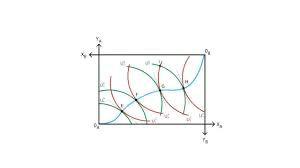

# scatter-gather
A scatter-gather implementation for financial data acquisition and algorithmic trading.
The scatter-gather model is declared as a state machine of custom future types designed to take max performance out of the architectural pattern of hierarchical state machines, preserving asynchronous properties on the overall pool of transactions.

# Build
```
cargo build --all --examples
```

# List of examples to run
```
cargo run --example
cargo run --example pool-to-grpc
```
# Build example project.
```
cargo build --release --bins
```
# Run example gRPC server (optimized).
```
cargo run --release --bin server
```
# Run example gRPC client. (Communicates with the server)
```
cargo run --release --bin client
```

# Project Structure
.\
├── CHANGELOG.md    : List of changes throughout versions\
├── LICENSE.md      : License\
├── README.md       : This file\
├── core            : Contains the common elements for the library\
├── examples        : Example use cases\
├── middleware      : Defines specific interceptors, helpers and utilities.\
├── src             : Generic API\
└── Cargo.toml      : Project Manifest
